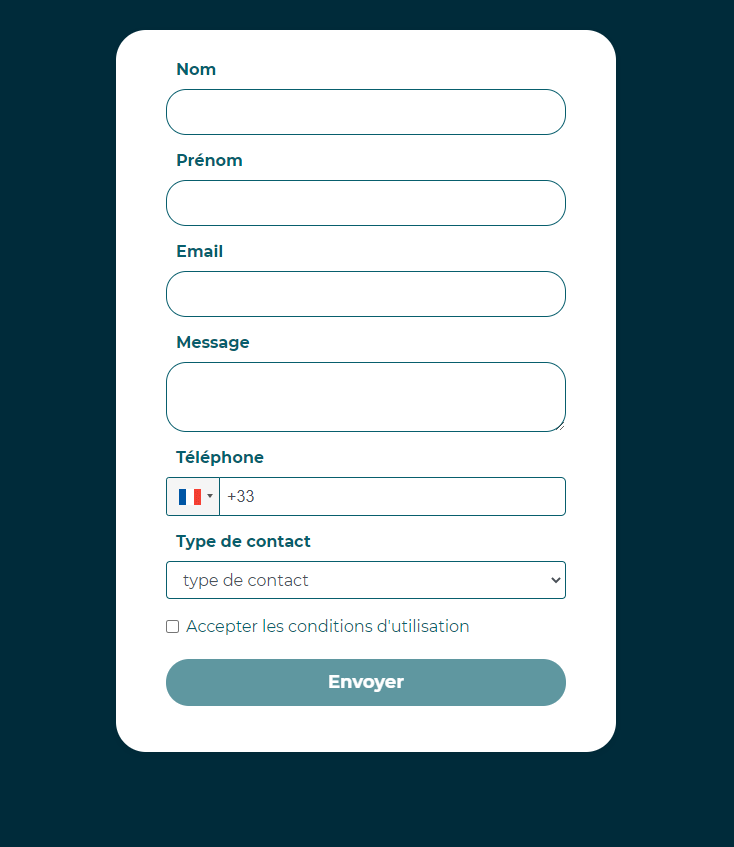

# Réalisation du test technique pour Koya

#### Créer une page avec un formulaire de contact :

| Champ                      |   Type   | Requis ? |
| -------------------------- | :------: | -------: |
| Nom                        |  Input   |      Non |
| Prénom                     |  Input   |      Non |
| Email                      |  Input   |      Oui |
| Télephone                  |  Input   |      Non |
| Message                    | Textarea |      Oui |
| Type de contact            | select:  |      Oui |
|                            |   Koya   |          |
|                            |  Mentor  |          |
|                            |  Public  |          |
| Acceptation des conditions | Checkbox |      Oui |

#### Stack :

1. À réaliser avec le framework React Js (en hooks de préférence).
2. Pour le style, vous pouvez utiliser un framework css (pas obligatoire)

#### Critères d’évaluation :

1. Respect de la consigne
2. Code propre et optimisé

#### Critères d’évaluation bonus :

1. Le visuel de la page
2. La validation des champs requis.

formulaire de contact:

### `git clone https://github.com/SNarboni/test-technique-koya.git`

Pour cloner les dossiers

### `cd test-technique-koya`

Pour aller dans le dossier

### `npm i` ou `npm install`

Pour installer les nodes modules

### `npm start`

Pour lancé l'application
